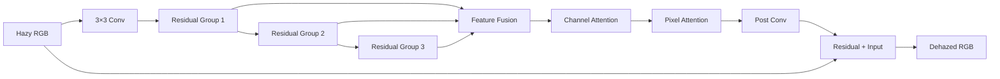

# FFA-Net on Haze4K

A PyTorch adaptation of **FFA-Net (Feature Fusion Attention Network)** for single-image dehazing on the Haze4K dataset, with a refactored training and evaluation workflow.

> **Focus:** reproduce a classic attention-based dehazing model on Haze4K, then turn the original research code into a cleaner, resumable, testable experiment pipeline.

[Architecture](docs/architecture.md) · [Usage](docs/USAGE.md) · [Results](docs/RESULTS.md)

## Project overview

FFA-Net combines residual feature extraction with **channel attention**, **pixel attention**, and **multi-group feature fusion** to reconstruct a clear image from a hazy input.

This repository preserves the original FFA model and parameter naming while improving the surrounding workflow for the COSC428 research project.

### What was adapted

- Haze4K train / test dataset support
- automatic hazy ↔ ground-truth pairing
- synchronized paired augmentation and cropping
- explicit CLI configuration
- separated training / validation engine
- checkpoint resume with optimizer state
- compatibility with legacy checkpoints and DataParallel weights
- saved-image PSNR / SSIM evaluation
- CSV and plot export
- CPU regression tests without downloading Haze4K or pretrained weights

The core FFA architecture in `net/models/FFA.py` is intentionally preserved.

## Architecture at a glance



Each residual block contains convolutional processing followed by channel attention and pixel attention. The three residual groups are fused adaptively before final reconstruction.

More detail: [docs/architecture.md](docs/architecture.md).

## Example Haze4K results

These are three illustrative test examples already stored in the repository. They are **not** presented as a full-test-set benchmark.

| Sample | Hazy PSNR | FFA PSNR | Hazy SSIM | FFA SSIM |
|---|---:|---:|---:|---:|
| 100 | 15.61 | **17.48** | 0.7223 | **0.8884** |
| 137 | 8.20 | **16.35** | 0.6581 | **0.8809** |
| 1000 | **21.35** | 20.32 | **0.9400** | 0.9229 |
| Mean of 3 | 15.05 | **18.05** | 0.7735 | **0.8974** |

Two examples improve strongly, while sample 1000 becomes slightly worse. That failure case is kept deliberately because it shows that dehazing quality is scene-dependent.

Visual comparisons and metric details: [docs/RESULTS.md](docs/RESULTS.md).

## Quick start

### 1. Install

```bash
python -m venv .venv
# Windows: .venv\Scripts\activate
# Linux/macOS: source .venv/bin/activate

pip install -r requirements.txt
```

For GPU training, install the PyTorch build that matches your CUDA environment.

### 2. Prepare Haze4K

Expected layout:

```text
data/Haze4K/
├── train/
│   ├── haze/
│   ├── gt/
│   └── trans/
└── test/
    ├── haze/
    ├── gt/
    └── trans/
```

The current pipeline uses `haze/` and `gt/`. Hazy files are matched to ground truth by the numeric identifier before the first underscore.

### 3. Train

```bash
python -m net.main \
  --data_root data \
  --trainset haze4k_train \
  --testset haze4k_test \
  --blocks 20 \
  --gps 3 \
  --bs 2 \
  --crop_size 240 \
  --lr 0.0001 \
  --steps 100000 \
  --eval_step 5000
```

### 4. Inference

```bash
python -m net.test \
  --task haze4k \
  --test_imgs data/Haze4K/test/haze \
  --output_dir samples/haze4k_predictions
```

### 5. Evaluate saved predictions

```bash
python -m net.evaluate_samples \
  --pred_dir samples/haze4k_predictions \
  --gt_dir data/Haze4K/test/gt \
  --csv samples/metrics.csv \
  --plot samples/metrics.png
```

Full commands and checkpoint behavior: [docs/USAGE.md](docs/USAGE.md).

## Repository layout

```text
FFA-Net-Haze4k/
├── net/
│   ├── main.py              # training entry point
│   ├── test.py              # inference entry point
│   ├── evaluate_samples.py  # PSNR / SSIM + CSV / plot
│   ├── option.py            # CLI options
│   ├── data_utils.py        # pairing, crop, augmentation, loaders
│   ├── engine.py            # training / validation / resume
│   ├── runtime.py           # paths, devices, checkpoints
│   ├── metrics.py           # PSNR / SSIM
│   └── models/
│       ├── FFA.py           # preserved FFA-Net architecture
│       └── PerceptualLoss.py
├── docs/
│   ├── architecture.md
│   ├── architecture_cn.md
│   ├── USAGE.md
│   ├── RESULTS.md
│   └── assets/results/
├── tests/
│   └── test_workflow.py
└── requirements.txt
```

## Engineering improvements around the original model

The model is only one part of the project. The refactor also addresses several reproducibility issues common in research code:

| Area | Improvement |
|---|---|
| Dataset | deterministic pairing rules with missing-GT validation |
| Augmentation | synchronized crop / flip / rotation for image pairs |
| Small images | resize the pair together instead of resampling indefinitely |
| Training loop | persistent iterator rather than recreating one every step |
| Checkpoints | latest + best model handling with optimizer restoration |
| Compatibility | legacy checkpoints and `module.` DataParallel prefixes |
| Imports | no CLI parsing or dataset scanning on import |
| Evaluation | standalone PSNR / SSIM evaluation for saved predictions |
| Validation | CPU regression tests using temporary synthetic images |

## Checkpoints

The original best-model filename is retained:

```text
trained_models/haze4k_train_ffa_3_20.pk
```

A companion latest-progress checkpoint is also written:

```text
trained_models/haze4k_train_ffa_3_20_last.pk
```

Resume prefers the latest checkpoint and falls back to the legacy best-model file.

## Tests

Run the lightweight regression suite:

```bash
python -m unittest discover -s tests -v
```

The tests cover paired augmentation, Haze4K / RESIDE loading, imports, checkpoint compatibility, optimizer restoration, batch traversal, and saved-image evaluation.

## Academic context

This repository is an adaptation of:

> Qin, X., Wang, Z., Bai, Y., Xie, X., and Jia, H.  
> **FFA-Net: Feature Fusion Attention Network for Single Image Dehazing.**  
> AAAI 2020.

The original architecture and paper should be cited when using this repository academically.

## Scope

This project should be read as:

**FFA-Net reproduction / adaptation + Haze4K experiment pipeline engineering**

rather than as a claim of a novel dehazing architecture or state-of-the-art benchmark.
